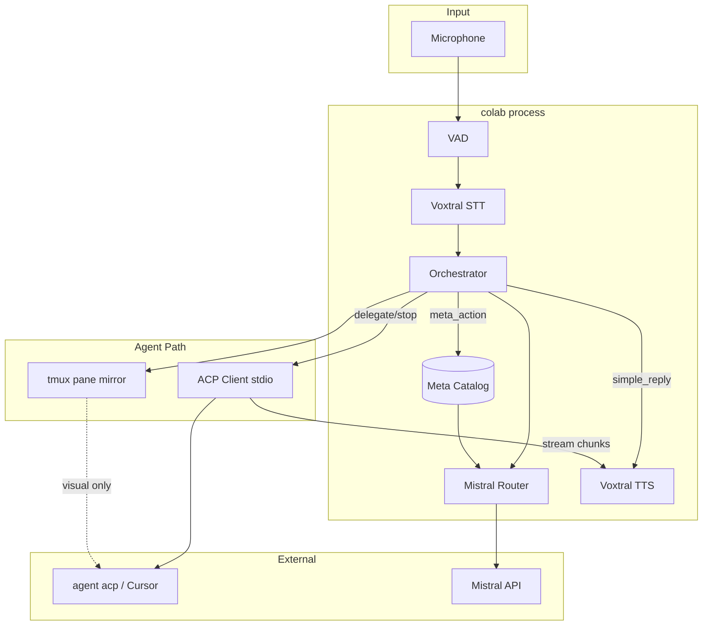

# ARCHITECTURE.md — colab

High-level design. **Behavioral truth:** `CONTRACT.md`. **Execution order:** `PLAN.md`.

---

## System context

---

## Layer responsibilities

| Layer | Module | Responsibility |
|-------|--------|----------------|
| CLI | `cli.py` | Typer commands, human I/O |
| Config | `config.py` | YAML merge, secrets, paths |
| Models | `model.py` | Pydantic contracts |
| Orchestrator | `orchestrator.py` | State machine, glue |
| ACP | `acp/*` | JSON-RPC, sessions, discovery |
| Router | `router/*` | Semantic classification |
| Audio | `audio/*` | STT, TTS, VAD (stubs) |
| tmux | `tmux/pane.py` | Visual session ensure |

---

## State machine (orchestrator)

States: `idle` | `listening` | `transcribing` | `routing` | `acting_local` | `acting_agent` | `speaking`

Transitions:

- `idle` → `listening`: daemon start
- `listening` → `transcribing`: VAD speech end
- `transcribing` → `routing`: STT final
- `routing` → `acting_*`: by `RouterDecision.intent`
- `acting_agent` → `speaking`: first content chunk
- `speaking` → `listening`: TTS complete OR barge-in
- any → `listening`: barge-in clears TTS + optional cancel

---

## ACP vs tmux (dual path)

| Concern | Primary | Secondary |
|---------|---------|-----------|
| Send user prompt | `session/prompt` | — |
| Stream response | `session/update` | tmux scrollback (human) |
| Cancel | `session/cancel` | `tmux send-keys C-c` |
| Meta `/clear` | catalog `delivery` field | often tmux send-keys |
| Session identity | `sessionId` in `~/.colab/sessions/` | — |

**Rule:** Never parse tmux pane text for agent state. ACP events are authoritative.

---

## Meta catalog lifecycle

1. **Discover** at startup (`meta.discover()`).
2. **Cache** to disk with version fingerprint.
3. **Refresh** on `colab meta refresh` or agent binary change.
4. **Router** reads snapshot (read-only during utterance).
5. **Execute** resolves `action_id` → delivery adapter.

---

## Config merge order

1. `src/colab/config.yaml` (package defaults)
2. `~/.colab/config.yaml` (user)
3. Environment overrides (`COLAB_*` — future)
4. CLI flags (future)

Secrets: `MISTRAL_API_KEY`, optional `CURSOR_API_KEY` / pre-`agent login`.

---

## Extension points (future)

| Extension | Mechanism |
|-----------|-----------|
| Second agent (Zed/Codex) | `agents.<name>` in config + ACP binary/path |
| flow STT backend | `audio.stt_backend: flow` |
| MCP control plane | separate package |

---

## Non-goals (v0.1)

- Web UI (see agentwire for reference)
- Wake word
- Multi-user
- Cloud deployment
